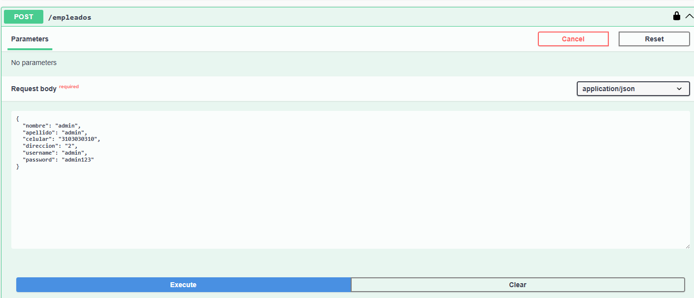
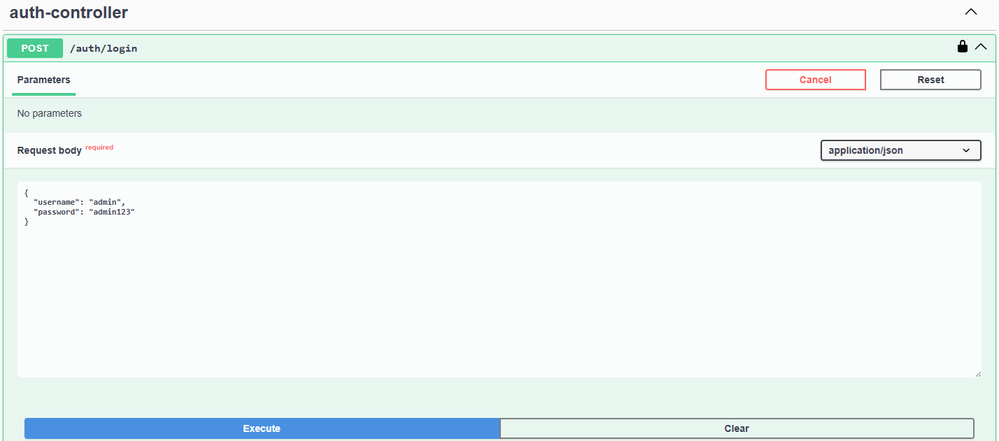
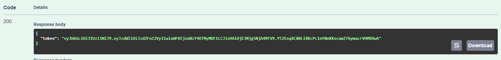
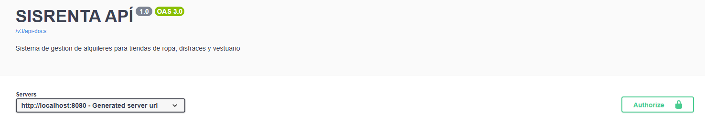
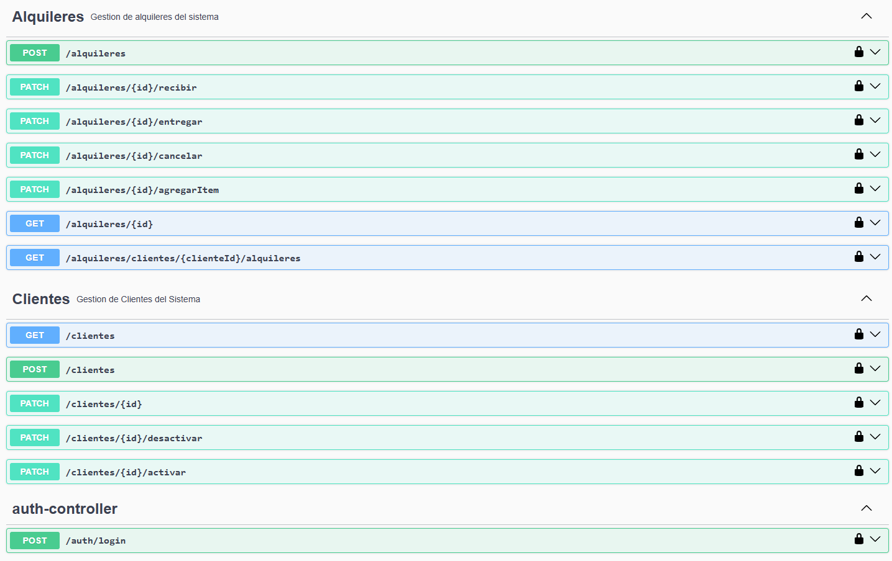

# 📦 Sisrenta - Sistema Integral de Renta

## 📑 Tabla de Contenido

1. [Información General](#-información-general)
2. [Tecnologías](#-tecnologías)
3. [Arquitectura](#-arquitectura)
4. [Instalación](#️-instalación)
5. [Seguridad y Autenticación](#-seguridad-y-autenticación)
6. [Uso de la API](#-uso-de-la-api)
7. [Swagger](#-swagger)

---

## 📖 Informacion general

Este proyecto es una **API REST para la gestión de alquileres de trajes y disfraces**, desarrollada en Java 21 con
Spring Boot.
Se conectara con Frontend usando React como framework,

El sistema permite administrar:

- 👤 Clientes
- 🧑‍💼 Empleados
- 📄 Alquileres
- 🧾 Ítems de alquiler

Incluye operaciones como:

- Registro, edición, activación y desactivación de clientes y empleados.
- Creación de alquileres.
- Agregar ítems a un alquiler.
- Consultar alquileres por cliente.
- Ver el detalle completo de un alquiler.

El proyecto sigue buenas prácticas de diseño:

- Separación por capas.
- DTOs para comunicación externa.
- Entidades con comportamiento.
- Services como orquestadores de casos de uso.
- Manejo centralizado de excepciones.

**Status del proyecto:**  
🚧 En desarrollo — versión académica/profesional para portafolio.

---

## 🧰 Tecnologias

Tecnologías utilizadas en el proyecto:

- ☕ **Java 21**
- 🌱 **Spring Boot 4.0.0**
- 🔐 **Spring Security + JWT**
- 🗄 **Spring Data JPA**
- 🐘 **PostgreSQL**
- 📦 **Maven**
- 🔄 **Hibernate**
- 📘 **Swagger (OpenAPI)**
- 📮 **Postman**

---

## 🗄 Arquitectura

El proyecto esta organizado por capaz

- controller -> exposición REST
- dto -> objetos de entrada y salida
- service -> casos de uso
- model -> entidades con lógica
- repository -> acceso a datos
- exception -> manejo de errores

### Principios Aplicados

Principios aplicados:

- DTO Pattern
- Domain Model
- Separation of Concerns
- RESTful design
- Transactional Services
- Centralized Exception Handling

Las entidades contienen comportamiento, no solo datos.

Los services orquestan los casos de uso.

Los controllers solo coordinan HTTP.

---

## ⚙️ Instalacion

### Requerimientos

Antes de iniciar asegúrate de tener instalado:

- Java 21
- Maven
- PostgreSQL (O la base de datos SQL que desee)
- Git

---

### Clonar el repositorio

```bash
git clone git@github.com:Sanavi01/sisrenta.git
cd sisrenta
```

### Crear una base de datos

```
CREATE DATABASE sisrenta_bbdd;
```

### Configurar la Base de Datos en el archivo application.properties

```
spring.datasource.url=jdbc:postgresql://localhost:5432/sisrenta_bbdd
spring.datasource.username=postgres
spring.datasource.password=tu_password

spring.jpa.hibernate.ddl-auto=update
spring.jpa.show-sql=true
spring.jpa.properties.hibernate.format_sql=true
```

### Correr la aplicacion

```
mvn clean install
mvn spring-boot:run

La aplicacion quedara disponible en 
http://localhost:8080
```

---

## Seguridad y Autenticacion

La API implementa autenticación basada en JWT (JSON Web Token) usando Spring Security.

En el archivo **application.properties** agrega una contraseña en **HS256**, por *PRACTICIDAD*
se da la siguiente:

```
jwt.secret=2270e73a86e507f7a99d98e739a62f96ec812c1a19b37a0db27785e620518566
jwt.expiration=3600000
```
**Características**:

- Contraseñas cifradas con BCrypt.
- Login mediante /auth/login.
- Protección de endpoints con JWT.
- Autorización por token en cada request.

**Solo estos endpoints son públicos:**

- **POST /empleados:** (Este se deja publico con el fin de poder crear un empleado,
  hacer login, obtener el token, usarlo para autenticarse y poder utilizar el resto de endpoints)
  
- POST /auth/login
  

El resto requiere token JWT.



Dicho token se utilizara en Authorize, una vez autenticados el resto de enpoints estara libre



## 🚀 Uso de la API

El flujo de uso es:

1) Crear un empleado.
2) Hacer login.
3) Obtener token JWT.
4) Usar el token para consumir la API.

## 📘 Swagger

Para mirar los endpoints se ha dado uso de la herramienta Swagger UI, una vez se inicie
el programa se podran encontrar los Endpoints en:

http://localhost:8080/swagger-ui/index.html#/

**Flujo recomendado:**

1) Ejecutar la aplicación.
2) Crear empleado.
3) Hacer login.
4) Copiar token.
5) Click en Authorize.
6) Pegar el token.
7) Probar endpoints protegidos.



